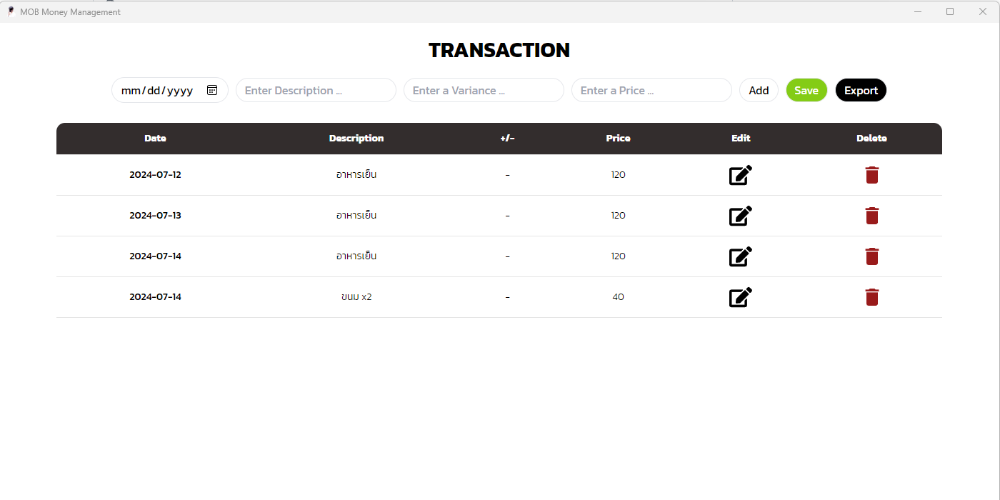

# MOB Money Management
Tracking your expenses in a simple small app.

## Requirement
1. Rust - used by tauri
2. `NPM/Yarn/Pnpm/Bun` - Select One
3. Your own basic CRUD api for this app

## CRUD Path that you need to have before use this application
You can use any rest api framework you prefer to use to connect database
1. `http://localhost:8080/api/transacts` for `GET` method
2. `http://localhost:8080/api/transacts` for `POST` method
3. `http://localhost:8080/api/transacts/1` for `GET` method
4. `http://localhost:8080/api/transacts/1` for `PUT` method
5. `http://localhost:8080/api/transacts/1` for `DELETE` method

## Example User Interface



## Recommended IDE Setup
How to start project
```bash
bun run tauri dev
```